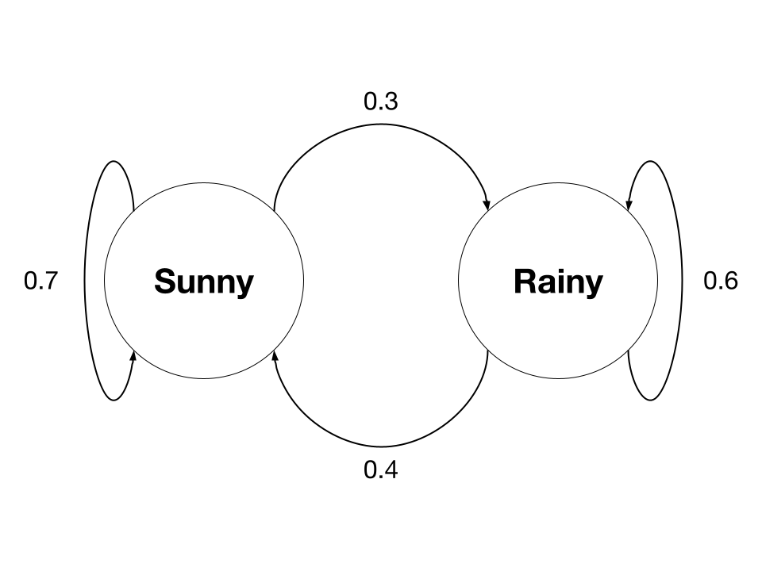

## Discord Chatbot

#### Introduction

Few years ago, I had came across <a href = "https://app.inferkit.com/demo">Talk to Transformer</a> and was surprised by the text generated. Some of them were rather human-like, some didn't make sense like the one shown below (on hindsight, this seems to be a noisy dataset problem), and others were hilarious. I was intrigued by how the text was generated and wanted to make my own text generator. However, there were a few reasons why I did not work on this back then:

1. I did not know much about coding, and most of the code that I have done were snippets found online. If a Python module was poorly documented and not much information can be found online, I would not be able to use it at all.

2. With regards to Natural Language Processing (NLP), all I knew was a bit of sentiment analysis, and my experience with it can be summed up in 2 lines.

   ```python
   from textblob import TextBlob
   print(TextBlob("string to be analysed").sentiment)
   ```

3. What's sklearn? What's TensorFlow? I had no idea, as my machine learning knowledge then was almost non-existent.

<p align = "center"></p>

<b><p align = "center">Talk to Transformer's generated text when the prompt "Hello, how are you." is provided</p></b>

And then I forgot about it. Fast forward to today, my friend @YeeShin504 suggested that I should take a look at <a href = "https://www.reddit.com/r/SubSimulatorGPT2/">r/SubSimulatorGPT2</a> on Reddit and make my own Subreddit Simulator. Looking at my potato PC and my empty wallet, I figured that I would not have sufficient resources to summon that many bots on my local machine. If you're asking me why I'm not using Google Colab to run my codes, my only reply would be that I dislike it. Nonetheless, you can use Google Colab, and demo codes for it can be found on the text generation modules that I have used.

Anyways, instead of making a chatbot on Reddit, I figured that I should move this project to Discord, since I never made a Discord bot before, so this will be a new experience.

In this writeup, we will discuss various ways to automatically generate text, such as Markov chains and Generative Pre-trained Transformer 2 (GPT-2).


#### Discord bot

Of course, since we are making a Discord chatbot, learning how to create a bot on Discord should be our very first step.

1. Head over to <a href = "https://discord.com/developers/applications">Developer Application</a> and click on **New Application**.

   <p align = "center"></p>

2. Name your application and provide some information about it in **General Information**. In our case, we will be making a chatbot.

   <p align = "center"></p>

3. Click on **Bot** in settings. Click on **Add Bot** under **Build-A-Bot**. Note that your bots cannot be erased from existence once you have created them.

   <p align = "center"></p>

4. Head over to **OAuth2** in settings after your bot has been built. Click on **URL Generator** under it.

   <p align = "center"></p>

5. Check the **bot** option under scopes.

   <p align = "center"></p>

6. Check any option you want under bot permissions. However, since we are working on a chatbot, the following options are the most important.

   <p align = "center"></p>

7. Copy the generated URL and paste it in your web browser. You can now invite your bot to your discord server through this generated URL.

Now that your Discord bot is finally set up, it is time to make it become alive. Instead of using classic *return* statements, we now use something called *await*. Do remember to insert your bot token when you run the following code, which can be found under **Build-A-Bot** by clicking **Bot** in settings. If the code is running, you can type "hello" and "bye" in *#general*. The bot would return a "hello" and "bye" message respectively.

```python
import discord
from discord.ext import commands

TOKEN = "YOUR_BOT_TOKEN"

bot = commands.Bot(command_prefix = "/")

@bot.event
async def on_ready():
    print(f"Thou hath summoned {bot.user}.")
    
@bot.event
async def on_message(message):
    if message.author == bot.user:
        return
    
    if message.content == "hello":
    	await message.channel.send("hello")
    elif message.content == "bye":
        await message.channel.send("bye")

bot.run(TOKEN)
```


#### Twitter scraping

To generate some text automatically, we would need to prepare some text for NLP. You can get some from online databases, but I prefer to take some online from a real user. This can be from a social media platform such as Youtube, Reddit or Facebook, but we will be using Twitter in this case. You may want to use its API via the <a href = "https://github.com/DocNow/twarc">twarc</a> module, but I don't like it for various reasons, mainly because of rate limitations (which can be increased if you get the premium version, but why would you do that?) and you can only obtain the last 3200 tweets made by each user.

As such, for most of my Twitter-related projects, I like to use the <a href = "https://github.com/twintproject/twint">twint</a> module, which avoids most of the limitations the Twitter API imposes.

For the testing of my bot, I will be using <a href = "https://twitter.com/scba">Sarah Miller</a> as an example. Well, you must be asking why I chose her as a test subject. Well...she was the first one that came to mind when it comes to tweets that seem human-like and are in English, and in my first CTF competition <a href = "https://ctf.tech.gov.sg/">STACK the Flags</a> the answer to one of the challenges was found in one of her tweets (which scarred my teammates greatly).

To scrape tweets using twint, you can read their wiki about the various functions twint has. The following code is what I used. Note that I removed retweets as they are not written by Sarah herself. We will also need to clean the tweets for processing later on.

```python
import twint

user = "scba"

c = twint.Config()
c.Username = user
c.Lang = "en"

# Settings
c.Filter_retweets = True # remove retweets
c.Hide_output = True

# Save to results
c.Custom["tweet"] = ["tweet"]
c.Output = f"{user}_tweets.csv"
c.Store_csv = True

twint.run.Search(c)
```

Do note that twint has not been updated for a year, so there may be potential problems that may surface. 

1. ```
   twint.token.RefreshTokenException: Could not find the Guest token in HTML
   ```

   This issue is referenced <a href = "https://github.com/twintproject/twint/issues/1320">here</a>. The solution to the issue is provided by @minaotorin. Under token.py, replace the refresh function with the following code:

   ```python
   def refresh(self):
           logme.debug('Retrieving guest token')
           res = self._request()
           match = re.search(r'\("gt=(\d+);', res.text)
           if match:
               logme.debug('Found guest token in HTML')
               self.config.Guest_token = str(match.group(1))
           else:
               headers = {
                   'User-Agent': 'Mozilla/5.0 (Windows NT 10.0; Win64; x64; rv:78.0) Gecko/20100101 Firefox/78.0',
                   'authority': 'api.twitter.com',
                   'content-length': '0',
                   'authorization': self.config.Bearer_token,
                   'x-twitter-client-language': 'en',
                   'x-csrf-token': res.cookies.get("ct0"),
                   'x-twitter-active-user': 'yes',
                   'content-type': 'application/x-www-form-urlencoded',
                   'accept': '*/*',
                   'sec-gpc': '1',
                   'origin': 'https://twitter.com',
                   'sec-fetch-site': 'same-site',
                   'sec-fetch-mode': 'cors',
                   'sec-fetch-dest': 'empty',
                   'referer': 'https://twitter.com/',
                   'accept-language': 'en-US',
               }
               self._session.headers.update(headers)
               req = self._session.prepare_request(requests.Request('POST', 'https://api.twitter.com/1.1/guest/activate.json'))
               res = self._session.send(req, allow_redirects=True, timeout=self._timeout)
               match = re.search(r'{"guest_token":"(\d+)"}', res.text)
               if match:
                   self.config.Guest_token = str(match.group(1))
               else:
                   self.config.Guest_token = None
                   raise RefreshTokenException('Could not find the Guest token in HTML')
   ```

2. ```
   Twint does not fetch tweets beyond a certain date.
   ```

   This issue is referenced <a href = "https://github.com/twintproject/twint/issues/1266">here</a>. The solution to the issue is provided by @klojohn. Under url.py, uncomment the following code found in line 92:

   ```python
   ('query_source', 'typed_query'),
   ```


#### Markov chain

Amongst all methods that can be used to generate text, I find Markov chains to be the easiest to understand and use.

We can use an example to visualise what is a Markov chain. Let us head down to City Z, where the people only experiences two types of weather conditions — sunny and rainy. On each day, it is either sunny or rainy in City Z, meaning both weather conditions cannot happen at the same time. Probabilities of each weather condition occurring follows a set of rules, which are:

* If yesterday was sunny, then the probability that today is sunny is 0.7.
* If yesterday was sunny, then the probability that today is rainy is 0.3.
* If yesterday was rainy, then the probability that today is sunny is 0.4.
* If yesterday was rainy, then the probability that today is rainy is 0.6.

The above example can be illustrated by a Markov chain as shown below. Each weather condition is known as a state, and an arrow in a Markov chain refers to a transition from state at time *t* to the next state at time *t + 1*. Note that the future state depends only on the current state.

<p align = "center"></p>

<b><p align = "centre">Markov chain</p></b>

We can use Markov chains in a similar fashion in automated text generation. We provide the Markov chain with text as shown below which will form the corpus (or dictionary) to be used.

```
I love snakes.
I love refrigerators.
I hate expensive refrigerators.
This is so expensive.
```

This would render a Markov chain as shown below, where *__ BEGIN __* and *__ END __* would act as beginning and ending delimiters respectively. Note that all the letters are in lowercase (<a href = "https://stackoverflow.com/a/45855350">good practice for most NLP problems</a>). Unfortunately, since we are using tweets as our text, lowercasing Twitter handles, hashtags and some acronyms may not be the best idea, so we are not going to do that later on.

<p align = "center"></p>

<b><p align = "centre">Markov chains for text generation</p></b>

We can use <a href = "https://github.com/jsvine/markovify">markovify</a> to generate text automatically using Markov chains, but the most important part is to process/clean the tweet first. This is how I do it, though not exactly accurate, but it'll make do:

```python
import re
def clean_tweet(tweet):
    # Convert to ASCII
    tweet = tweet.encode("ascii", errors = "ignore").decode()
    
    # Do not add new line
    tweet = re.sub("\n", " ", tweet)

    # Ampersand escape (HTML)
    tweet = re.sub("&nbsp;", " ", tweet)
    tweet = re.sub("&lt;", "<", tweet)
    tweet = re.sub("&gt;", ">", tweet)
    tweet = re.sub("&amp;", "&", tweet)
    tweet = re.sub("&quot;", '"', tweet)
    tweet = re.sub("&apos;", "'", tweet)
    tweet = re.sub("&cent;", "¢", tweet)
    tweet = re.sub("&pound;", "£", tweet)
    tweet = re.sub("&yen;", "¥", tweet)
    tweet = re.sub("&euro;", "€", tweet)
    tweet = re.sub("&copy;", "©", tweet)
    tweet = re.sub("&reg;", "®", tweet)

    # Convert to list for deep cleaning
    tweet = tweet.split(" ")
    
    # Remove mentions if they are at start of the tweet (this would mean it is a reply)
    while tweet and tweet[0] and tweet[0][0] == "@":
        tweet.pop(0)

    # Remove . if they are at start of the tweet (most users use . to avoid making the tweet a reply)
    if tweet and tweet[0] and tweet[0][0] == ".":
        tweet[0] = tweet[0][1:]

    # Remove # if it is hashtag (ignore cashtags, since it could also be dollar sign)
    tweet = [re.sub("#", "", word) if len(word) > 1 and word[0] == "#" else word for word in tweet]

    # Remove @ if it is mention
    tweet = [re.sub("@", "", word) if len(word) > 1 and word[0] == "@" else word for word in tweet]
    
    # Remove empty word
    tweet = [word for word in tweet if word != ""]

    # Remove links (if link is in middle of tweet, we will not use this tweet for NLP, since sentences will be broken)
    while tweet and tweet[-1][:4] == "http":
        tweet.pop()
    
    for word in tweet:
        if word[:4] == "http":
            tweet = []
            break

    # Make first letter capitalised
    if tweet:
        tweet[0] = tweet[0][0].upper() + tweet[0][1:]

    # Convert back to string
    tweet = " ".join(tweet)
    
    return tweet
```

For example, if we have the tweet "Dear @Disney, DO NOT SCREW THIS UP. Sincerely, A die-hard #firefly fan.  https://t.co/DAZOwcHZke", this will become "Dear Disney, DO NOT SCREW THIS UP. Sincerely, A die-hard firefly fan." If tweet is empty after processing it, we do not use it later on.

We then create the naive model which is used later, but you can use the <a href = "https://github.com/explosion/spaCy">SpaCy</a> or <a href = "https://github.com/JohnSnowLabs/spark-nlp">Spark NLP</a> modules for part-of-speech tagging and override functions from markovify (so that it performs better). I heard Spark NLP is better than SpaCy, though I haven't tested it out yet, but both are definitely better than the standard <a href = "https://github.com/nltk/nltk">nltk</a> module.

In any case, I gave my bot a run and here are some sentences the bot generated:

<p align = "center"></p>

But most of the sentences would still seem weirdly phrased. Let us test GPT-2 next and see where it brings us to!


#### GPT-2

We can use the <a href = "https://github.com/minimaxir/gpt-2-simple/">gpt-2-simple</a> module to train OpenAI's GPT-2 text generating model on our own text (and not understand most of the complex stuff behind how it works). GPT-2 takes up a lot of resources, so it is best if you use it on Google Colab instead of your local PC. Nonetheless, I will still be training and testing my GPT-2 model on my local machine (aka potato PC).

The following models can be downloaded:

| Size  | What it means                                              |
| :---: | ---------------------------------------------------------- |
| 124M  | Small model. Takes up 500MB of storage. Can be finetuned.  |
| 355M  | Medium model. Takes up 1.5GB of storage. Can be finetuned. |
| 774M  | Large model. Cannot be finetuned.                          |
| 1558M | Extra large model. Cannot be finetuned.                    |

Larger models have more knowledge, but take longer to finetune and generate text. Larger models also require more resources, so I would just stick to the small model. The GPT-2 model of size 124M can be downloaded using the following code:

```python
gpt2.download_gpt2(model_name = "124M")
```

Other than choosing the model, we would need to finetune it. These are the parameters that we can modify:

|   Parameter   | What it means                                                |
| :-----------: | ------------------------------------------------------------ |
|     steps     | Maximum number of training iterations. To have finetuning run indefinitely, set `steps = -1`. However, do note that overfitting can occur if you train your model for extremely long periods of time, especially if your text is short form. Tweets are considered as short form text since there is a 280 character limit, so we will train it with fewer steps. |
| restore_from  | Set to `fresh` to start training from the base GPT-2, or set to `latest` to restart training from an existing checkpoint. |
| sample_every  | Prints example output every *n* number of steps.             |
|  print_every  | Prints training progress every *n* number of steps.          |
| learning_rate | Learning rate for training the GPT-2 model. Default value is set to `1e-4`, but you can lower it to `1e-5` if you have less than 1MB of input data. |
|   run_name    | Refers to the subfolder within checkpoint where your model is saved. This is useful if you are working with multiple models, but you will also need to specify  `run_name` when loading your model. |
|   overwrite   | Set to `True` if you want to continue finetuning an existing model without creating duplicate copies. Note that you should already have an existing model and set `restore_from = True` during this session of finetuning. |

Since gpt-2-simple does not provide beginning and ending delimiters if you use a txt file instead of a csv file, we should include them ourselves (note that markovify in the previous experiment has provided us with these delimiters already). I set the beginning and ending delimiters to "<|startoftext|>" and "<|endoftext|>" respectively, which is the same as the one provided if we used a csv file. I have only trained the GPT-2 model for 100 steps, but you can improve its performance by training it for 500 or even 1000 steps.

I finetuned my model using the following code, and I have stored the cleaned tweets in scba_gpt2.txt:

```python
sess = gpt2.start_tf_sess()
gpt2.finetune(sess, "scba_gpt2.txt", model_name = model_name, restore_from = "fresh", steps = 100)
```

When generating the text from a previously trained model, there are some parameters that we can look at (some are not that important, so we will not look at them):

|  Parameter  | What it means                                                |
| :---------: | ------------------------------------------------------------ |
|   length    | Number of tokens to generate, where the default value is 1023. In the case of NLP, <a href = "https://www.analyticsvidhya.com/blog/2020/05/what-is-tokenization-nlp/">tokens can be either words, characters or sub-words</a>. |
| temperature | The higher the temperature, text generated will become more original and less repetitive. Default value is set to 0.7, and it is recommended to keep the temperature between the range of 0.7 and 1.0. |
|    top_k    | Generates *k* guesses for the next words . Default value is set to 0 which means that there are no restrictions. Many people have preferred to use `top_k = 40`. |

We generate text that is sent by the bot using the following code:

```python
m = gpt2.generate(sess,
                  prefix = "<|startoftext|>",
                  truncate = "<|endoftext|>",
                  include_prefix = False,
                  return_as_list = True)[0]
```

GPT-2 does generate text that makes more sense than Markov Chains, and the text is more than just a single sentence. That's awesome! But at what cost? The generation of text by gpt-2-simple takes up more time and resources than markovify, and from what I have noticed it takes about 2-4 minutes to generate some text on my potato PC. The above code to generate the text still works, but it often would lead to some empty messages. Maybe this would work better if I had trained the GPT-2 model for more steps, I don't know.

In any case, I gave my bot a run and here are some texts that the bot generated:

<p align = "center"></p>


#### Conclusion

As seen earlier, our Discord Chatbot has not reached the state where it can hold a conversation and answer  specific questions. This is due to the data that we used, since most Twitter posts are more similar to broadcasts heard by a group of people than a one-to-one talk. In the future, I do hope that I can make a better chatbot.


To add on, I would also want to test out the <a href = "https://github.com/minimaxir/aitextgen">aitextgen</a> module some time in the future, since according to its documentation it is able to generate text faster and uses memory more efficiently.

